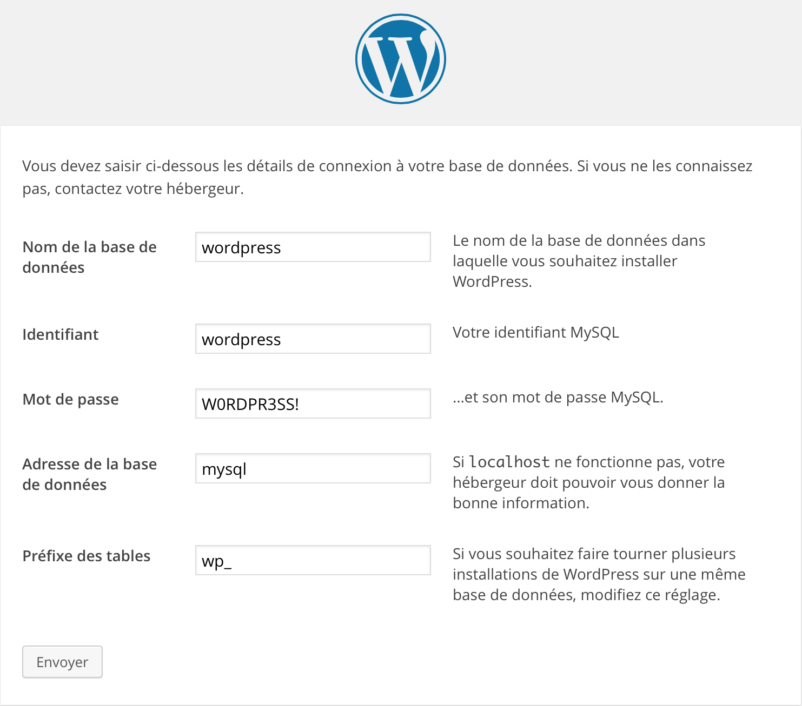

# Wordpress on a 50MB Docker's image

[](https://imagelayers.io/?images=vibioh/wordpress:latest 'Get your own badge on imagelayers.io')

[TOC]

## Forewords

All images used in this guide are based on the latest [Alpine image](https://registry.hub.docker.com/_/alpine/). A very light Linux distributions, shipped with nothing, perfect for making one role image.

## Mysql Docker

In order to run Wordpress, the first thing we need is a database. Wordpress works pretty well with MySql, so we will start a container for it.

### Starting the container for Mysql

The entrypoint of MySql's image allows us to create a database and user with credentials to connect (largely inspired by [MySQL official image](https://github.com/docker-library/mysql) and [Hypriot MySQL image](https://github.com/hypriot/rpi-mysql))

The full Dockerfile is available on my [GitHub account](https://github.com/ViBiOh/docker-mysql/blob/master/Dockerfile).

```bash
docker run -d --name mysql --user mysql --read-only -e MYSQL_ROOT_PASSWORD=s3cr3t! -e MYSQL_DATABASE=wordpress -e MYSQL_USER=wordpress -e MYSQL_PASSWORD=W0RDPR3SS! -v /var/wordpress/mysql:/var/lib/mysql vibioh/mysql:latest
```

Some explanations are welcome:

* `-d` option start the container as a *daemon*
* `--name mysql` option gives a name to the container. It's especially important in our case. Next, we will link containers and they must be referenced by name
* `--user mysql` option start the mysqld with a non-root user, *mysql*
* `--read-only` option define a read-only filesystem (security reason)
* `-e MYSQL_ROOT_PASSWORD=s3cr3t!` option defines the root's password of MySql (MariaDB) used to initialize database structure
* `-e MYSQL_DATABASE=wordpress` option defines the database's name that will be created when the container starts
* `-e MYSQL_USER=wordpress -e MYSQL_PASSWORD=W0RDPR3SS!` option defines the username with its credentials that will have access to database created
* `-v /var/wordpress/mysql:/var/lib/mysql` option is an important part too. Here we define the place in the host machine where MySql will store its data so that the container can die, your datas are safe.
* We don't use the `-p` to expose port 3306 to external connections (outside of host machine). Only Docker will need access to the container.

## Wordpress Docker

The second thing Wordpress needs is a HTTP server, with PHP enabled and zlib to uncompress modules, themes, updates, etc.

### Prerequisite

We will externalize the `wp-content` directory in order to not modify it inside the container. This directory contains all datas that make your Wordpress unique. So, first thing to do is to retrieve the standard structure of this directory locally.

> You can skip this step in test environment. When you delete the container, you lost all datas. In next steps, don't add the volume to the Wordpress container.

```bash
wget fr.wordpress.org/wordpress-latest-fr_FR.zip
unzip wordpress-latest-fr_FR.zip
rm -rf wordpress-latest-fr_FR.zip
mv ./wordpress/wp-content /var/wordpress/wp-content
rm -rf ./wordpress
chown -R nobody:nogroup /var/wordpress/wp-content
```

### Starting the container for Wordpress

```bash
docker run -d --name wordpress --user nginx --read-only --link mysql:mysql -v /var/wordpress/wp-content:/var/www/wordpress/wp-content vibioh/wordpress:latest
```

Some explanations are welcome:

* `--link mysql:mysql` option is the most interesting one. Our MySql container doesn't expose any port to the outside world and even if, we don't want to manage its IP. So we link the container `mysql` (first one) to our new container with the name `mysql`. What Docker does is to modify the `/etc/hosts` to match container's ip to the given alias.
* `-v [...]` option defines where the Wordpress content is on the host, like we previously made it for MySql.
* Again, we don't use the `-p` option for allowing external connections to the container with default port. We'll use a frontal server in Docker.

## Nginx Docker

You can map the Wordpress container directly to the host's port 80 but the interesting thing with Docker is the ability to run many containers in one physical (or virtual !) machine. So, we put a frontal nginx that will dispatch request based on domain's name. In clear, act as a reverse proxy. And guess what, this nginx will be a container too.

### Configure the nging proxy

Create the file `/var/wordpress/blog.vibioh.fr.conf`

```
server {
  listen 80;
  server_name blog.vibioh.fr;

  location / {
    proxy_pass http://wordpress;
    proxy_set_header Host            blog.vibioh.fr;
    proxy_set_header X-Forwarded-For $remote_addr;
  }
}
```

Some explanations are welcome:

* `proxy_pass http://wordpress` option indicate to nginx to route traffic based on domain name `blog.vibioh.fr` to `wordpress`. This route will be searched in the `/etc/hosts` first, and this file will be changed by Docker when we'll link the nginx's container to the wordpress one.

### Starting the container for Nginx

```bash
docker run -d -p 80:80 --name nginx --read-only --link wordpress:wordpress -v /var/wordpress/blog.vibioh.fr.conf:/etc/nginx/sites-enabled/blog.vibioh.fr vibioh/nginx:latest
```

Some explanations are welcome:

* `-p 80:80` option defines that container's port **80** (second one) will be accessible via the host's public port **80** (first one). This is important for a web server to be accessible to the entire world.
* `--link wordpress:wordpress` again we link two containers to allow them to communicate simply.
* We don't run nginx container with `--user nginx` because opening port below 1024 require root access.

## Configuring Wordpress

Connect to [Wordpress](http://blog.vibioh.fr/) and follow instructions to install Wordpress.



**Congratulations**, you can now browse to [Wordpress admin](http://blog.vibioh.fr/wp-admin/) to start configuring your blog :)

## With docker-compose ?

Starting and linking containers can be tedious and generate a lot of command line. Docker offers the possibility to start multiple related containers with **docker-compose**.

## On an `armhf` infrastructure

This tutorial has been executed on a standard architecture (x68/x64) architecture. You can run it on an ARM infrastructure (e.g. a Raspberry Pi2 running [HypriotOS](http://blog.hypriot.com)).

To do that, you have to build your own ARM images from the same Dockerfile used for building standard images. The only thing that change is the base `alpine` image, an ARM one. All behave the same way if you don't forget to add the `-arm` to every image's name.

### Create a MySql image

```bash
git clone https://github.com/ViBiOh/docker-mysql.git
cd docker-mysql
sed -i "s/alpine/vibioh\/alpine-arm/" Dockerfile
docker build -t vibioh/mysql-arm --rm .
```

### Create a nginx image

```bash
git clone https://github.com/ViBiOh/docker-nginx.git
cd docker-nginx
sed -i "s/alpine/vibioh\/alpine-arm/" Dockerfile
docker build -t vibioh/nginx-arm --rm .
```

### Create a Wordpress image

```bash
git clone https://github.com/ViBiOh/docker-wordpress.git
cd docker-wordpress
sed -i "s/vibioh\/nginx/vibioh\/nginx-arm/" Dockerfile
docker build -t vibioh/wordpress-arm --rm .
```